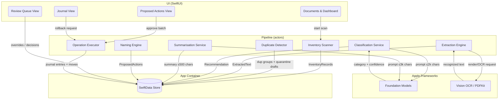

# Design Document: Private Archive Organizer

## Overview

Discovery (product name: Private Archive Organizer) is a sandboxed SwiftUI macOS app targeting macOS 26 (Apple silicon). It implements a staged, resumable document pipeline: **inventory → duplicate detection → extraction → classification → naming → proposal → approved execution**, with a Review Queue absorbing every ambiguous case and an append-first Operation Journal making every filesystem change verifiable and reversible.

The architecture enforces the spec's central invariant structurally: the two probabilistic components (Classification Service, Summarisation Service) can only *write recommendations into the local store*. Only the deterministic Operation Executor touches archive files, and it accepts only validated, user-approved `ProposedAction` values. Privacy is enforced at the OS layer — the app ships with App Sandbox enabled and **no network entitlement**, so no code path (present or future) can transmit anything.

All model work uses the Apple Foundation Models framework (`SystemLanguageModel.default`) with guided generation (`@Generable`), which is on-device only. When the model is unavailable the pipeline runs in Degraded Mode: deterministic stages continue; classification/summarisation park as "pending".

> **Note for implementing agents:** Foundation Models and new Vision API names below reflect the macOS 26 SDK as designed. Verify exact signatures against the installed SDK docs (`LanguageModelSession`, `@Generable`, `@Guide`, `SystemLanguageModel.availability`, `RecognizeTextRequest`) before use; do not invent fallback APIs if a name differs — check documentation.

## Goals / Non-Goals

**Goals:**
- Implement the full Requirements 1–15 pipeline in one native app, entirely on-device.
- Make the privacy boundary structural (sandbox, no network entitlement, app-container-only metadata) rather than conventional (Req 1, 11).
- Make every archive mutation approved, hash-verified, journaled, and rollback-capable (Req 7, 8, 10).
- Keep probabilistic output (category, confidence, summary) strictly advisory via type separation (Req 5).
- Remain fully functional for deterministic work in Degraded Mode (Req 12).
- Ship a test suite that runs on CI (existing `ci.yml`: `Discovery.xcodeproj`, scheme `Discovery`, `DiscoveryTests`, `DiscoveryUITests`) against synthetic fixtures only (Req 14).

**Non-Goals:**
- Multiple Archive Roots — v1 supports exactly one user-selected root (Req 1.2), so all moves are same-volume renames; multi-root support and cross-volume move handling are a follow-up spec.
- Taxonomy editing UI (Req 15 fixes the taxonomy; config format is forward-compatible).
- Handwriting recognition quality guarantees, non-Latin language tuning.
- Any cloud path, Private Cloud Compute, or third-party model integration.
- Background daemon / Spotlight importer / menu-bar agent — this is a foreground document app.
- Windows/Linux/iOS targets.
- Permanent deletion, even user-triggered — quarantine only.

## Decisions

### Decision 1: Platform baseline — macOS 26, Apple silicon, Swift 6, SwiftUI

**Outcome**: Target macOS 26+, Apple silicon only, Swift 6 strict concurrency, SwiftUI app lifecycle. The repo already contains a committed template `Discovery.xcodeproj` (Swift 5.0 language mode, `MACOSX_DEPLOYMENT_TARGET = 26.5`, sandbox on, no entitlements file, no shared scheme): implementation **updates** that project in place — Swift 6 language mode, keep the 26.5 deployment target, add the entitlements file, and check in a shared `Discovery` scheme under `xcshareddata/xcschemes/` (required for `xcodebuild -scheme` on a fresh CI checkout).

**Reasoning**: The Foundation Models framework (Req 5, 9, 11) requires macOS 26 with Apple Intelligence on Apple silicon, so a lower deployment target only adds dead code paths. Swift 6 concurrency lets the pipeline be actor-isolated, which is how we guarantee single-writer semantics for the journal. CI is already committed expecting `Discovery.xcodeproj` and scheme `Discovery`, and preflight confirmed the template project's defaults conflict with these settings, so reconciling it is an explicit first task rather than an implicit assumption.

**Alternative Options**: AppKit (rejected: no benefit for this UI, more code); supporting Intel via Degraded-Mode-only builds (rejected: doubles the QA matrix for a personal-use v1).

### Decision 2: Privacy enforced by entitlements — no network entitlement at all

**Outcome**: The app ships sandboxed (`com.apple.security.app-sandbox = true`, `com.apple.security.files.user-selected.read-write = true`, `com.apple.security.files.bookmarks.app-scope = true`) and deliberately omits `com.apple.security.network.client` and `.server`.

**Reasoning**: Req 11.2/11.4 demand that content never leaves the device and that no silent fallback exists. Omitting the network entitlement makes the OS reject any socket the process ever opens, converting a policy requirement into a mechanically enforced property that a unit test can assert by parsing the `.entitlements` file (Property 10). Foundation Models' system model is on-device, so no entitlement is needed for it.

**Alternative Options**: Runtime network-monitor assertions (weaker — only detects, doesn't prevent); NEFilterProvider content filter (massively over-scoped, needs system extension approval).

### Decision 3: Persistence with SwiftData in the app container

**Outcome**: All metadata — inventory, extraction results, recommendations, summaries, review items, journal — lives in one SwiftData store under `Application Support/Discovery/` inside the sandbox container. Nothing except archive documents and the Quarantine Folder is ever written inside the Archive Root (Req 1.6). Concurrency pattern: one shared `ModelContainer`; each pipeline actor (`InventoryScanner`, `ExtractionEngine`, `ClassificationService`, `SummarisationService`, `OperationExecutor`) is a `@ModelActor` owning its own `ModelContext`. Values crossing actor boundaries are either `PersistentIdentifier`s or dedicated `Sendable` snapshot structs — never `@Model` class instances (which are not `Sendable` and will not compile under Swift 6 strict concurrency). `ArchiveRoot` in the interfaces below is such a snapshot struct, not the `ArchiveRootRecord` model.

**Reasoning**: SwiftData is Apple-native (no dependency), integrates with SwiftUI observation, and is sufficient for tens of thousands of records. Keeping metadata out of the Archive Root keeps user folders clean and makes Req 1.6 testable as a path-prefix property. Pinning the `@ModelActor`/snapshot pattern up front prevents the classic Swift 6 stall where `@Model` instances get passed between actors and nothing compiles.

**Alternative Options**: GRDB/SQLite (more control, but adds a dependency and boilerplate for v1); JSON files (no query capability, fragile for the journal).

### Decision 4: Write-ahead journaling for crash safety

**Outcome**: Every filesystem operation writes a `JournalEntry` with state `pending` *before* touching the filesystem, then flips it to `committed` or `failed` afterwards. On launch, `pending` entries are reconciled by hash-probing source and destination paths, marked `interrupted`, and routed to the Review Queue.

**Reasoning**: Req 7.5/8.4 require the journal to be the source of truth for rollback; a post-hoc log can miss a crash mid-move. Write-ahead entries mean the journal can always explain the filesystem state, and reconciliation makes interrupted batches visible instead of silent (Req 13.1 "aborted operations").

**Alternative Options**: FSEvents-based after-the-fact auditing (observational, cannot drive rollback); APFS snapshots (require elevated privileges, violate least-privilege).

### Decision 5: Foundation Models guided generation with self-reported confidence

**Outcome**: Classification and summarisation use `LanguageModelSession.respond(to:generating:)` with `@Generable` output types. The category field is a `@Generable` enum constrained to the Category Taxonomy + `unknown`; confidence is a `@Guide(.range(0...1))` double reported by the model. Default review threshold: **0.7**, user-configurable (Req 5.4).

**Reasoning**: Guided generation constrains output to the schema, eliminating parse failures and guaranteeing Req 5.1's "exactly one category from the taxonomy or Unknown" at the type level. The framework exposes no token log-probabilities, so self-reported confidence is the only per-call signal available; the Review Queue and threshold exist precisely to absorb its unreliability.

**Alternative Options**: N-sample majority voting for a frequency-based confidence (3–5× latency per document across a large archive; can be a later spec); embedding-similarity classification via NLEmbedding (weaker semantics for niche document types, but a candidate future cross-check).

### Decision 6: Extraction stack — PDFKit, Vision OCR, NSAttributedString, ZIPFoundation

**Outcome**: Text-layer PDFs via `PDFDocument` string extraction; scanned PDFs rendered per-page at 300 DPI then OCR'd with Vision (`RecognizeTextRequest`, accurate mode); images OCR'd directly; DOCX via `NSAttributedString(url:options:)` with `.officeOpenXML`; RTF/TXT/CSV via AppKit/Foundation; XLSX via **ZIPFoundation** (the only third-party dependency, pinned by exact version) + `XMLParser` over `sharedStrings.xml` and sheet XML.

Text-layer detection is **per page**, not per document: a PDF page "has a text layer" iff PDFKit extraction of that page alone is not an Insufficient Extraction (< 25 non-whitespace chars). Pages with a text layer use it directly; pages without are rendered at 300 DPI and OCR'd; results merge in page order. This handles hybrid PDFs (a letter with real text pages plus a scanned attachment page) without silently dropping the scanned pages' content — the failure mode a whole-document heuristic has.

**Reasoning**: Everything is local (Req 4.4) and Apple-provided except XLSX, which has no system parser; ZIPFoundation is a small, MIT-licensed, pure-Swift zip reader — acceptable dependency cost for a required format (Req 2.2 Glossary). Per-page detection satisfies Req 4.1/4.2 precedence for every page individually, which is the only reading under which a hybrid document's content is fully extracted.

**Alternative Options**: Writing a minimal zip central-directory reader in-repo (~300 lines, no dependency — acceptable fallback if the dependency is unwanted); dropping XLSX (violates the pinned Supported Office Document list).

### Decision 7: Deterministic near-duplicate detection — text shingles + perceptual hash

**Outcome**: Two deterministic signals: (a) Jaccard similarity ≥ **0.70** between 4-character shingle sets of normalized Extracted Text; (b) for image-bearing documents, 64-bit dHash Hamming distance ≤ **10** on the first page/image. Either signal flags a Near-Duplicate Candidate. Pairs already grouped as Exact Duplicates are excluded before comparison.

**Reasoning**: Req 3.2 requires determinism and no model involvement; both measures are pure functions of file bytes. Thresholds are named constants so the fixture-anchored test (Req 3.4) pins behaviour. Pairwise comparison is O(n²) but bounded by comparing only within same broad type (text-bearing vs image-only) — fine at personal-archive scale.

**Alternative Options**: MinHash/LSH indexing (only needed if archives exceed ~50k documents; keep as noted optimisation); Vision feature-print distance (model-adjacent and less explainable; excluded by Req 3.2's "no model involvement").

### Decision 8: Naming convention

**Outcome**: `YYYY-MM-DD_<Category>_<IssuerSlug>.<ext>` — document date (falls back to file creation date only via Review Queue confirmation, Req 6.4), category folder name, issuer/subject slugified to `[A-Za-z0-9-]`, max 80 chars before extension; collision suffix `_2`, `_3`, … (Req 6.3). Charset scoping: `[A-Za-z0-9-]` constrains the *issuer slug component only*; the assembled filename validator accepts `[A-Za-z0-9-_.]` (the `_` separators and extension dot). Validation is a pure function `validateFilename(_:in:)`.

**Reasoning**: Sorts chronologically in Finder, is charset-safe on APFS and exFAT backups, and every field is either deterministic or human-confirmed. A pure validation function makes Req 6.2 property-testable.

**Alternative Options**: `<Category>/<Year>/` deep hierarchies (harder to flatten/rollback; category folders already partition), spaces in names (breaks scripts users may run over the archive).

### Decision 9: Model-call input budgeting

**Outcome**: Classification prompt receives the first **2,000 characters** of whitespace-normalized Extracted Text. Summarisation receives the first **3,000 characters**; the returned summary is deterministically truncated at a sentence boundary to ≤ **500 characters** before storage (Req 9.1's cap is enforced by code, not by trusting the model).

**Reasoning**: The on-device model's context window is small (≈4k tokens); document heads carry letterheads, dates, issuers, and subjects — the identifying content. Deterministic truncation keeps a probabilistic component from violating a SHALL.

**Alternative Options**: Chunked map-reduce summarisation (better for long documents; deferred — summaries are identification aids, not abstracts).

### Decision 10: Single Archive Root in v1

**Outcome**: The first release supports exactly one Archive Root (Req 1.2). Category folders and `_Quarantine` live directly under it; selecting a new root replaces the old after explicit confirmation.

**Reasoning**: Preflight review found that the earlier multi-root design silently consolidated documents from all roots under one "primary" root — surprising user-facing behaviour — and introduced cross-volume moves (`EXDEV` rename failures, non-atomic copy+delete) that the write-ahead journal design did not address. With one root, every move is a same-volume atomic rename, which keeps Properties 1–3 simple and true. Confirmed with the user on 2026-07-13.

**Alternative Options**: Per-root category folders (files never leave their volume, but categories split across roots); consolidation under a primary root with a journaled copy+verify+delete `EXDEV` fallback (more machinery for a v1 nobody asked for). Either can be a follow-up spec without changing the executor's contract.

## Architecture



Control flow is a per-document state machine stored on `InventoryRecord.status`:

```
discovered → hashed → extracted | extractionFailed | unsupported | unreadable
extracted → classified | reviewPending
classified/userOverridden → named | reviewPending
named → proposed → approved → moved (terminal, rollbackable)
any model stage in Degraded Mode → pendingModel
```

Stages are pull-based: each pipeline actor queries the store for records in its input status, processes them, and advances the status. This makes the pipeline resumable after quit/crash with no in-memory queue to lose, and makes Degraded Mode trivial (model stages simply don't pull).

## Components and Interfaces

Source layout (all paths relative to repo root):

```
Discovery.xcodeproj
Discovery/
  DiscoveryApp.swift              // @main, ModelContainer setup
  Entitlements/Discovery.entitlements
  Config/Taxonomy.json            // Req 15.3 single local configuration
  Domain/
    Types.swift                   // Category, DocumentStatus, errors
    ArchiveAccess.swift           // ArchiveAccessManager
    InventoryScanner.swift
    HashService.swift
    DuplicateDetector.swift
    Extraction/
      ExtractionEngine.swift
      PDFExtractor.swift  OCRExtractor.swift  OfficeExtractor.swift
    ModelServices/
      ModelAvailability.swift
      ClassificationService.swift
      SummarisationService.swift
    NamingEngine.swift
    Execution/
      OperationExecutor.swift
      JournalReconciler.swift
  Persistence/
    Models.swift                  // SwiftData @Model classes
    Store.swift
  UI/
    MainWindow.swift  DocumentsView.swift  ReviewQueueView.swift
    ProposedActionsView.swift  DuplicatesView.swift  JournalView.swift
    SettingsView.swift  OnboardingView.swift
DiscoveryTests/
  Fixtures/FixtureFactory.swift   // generates synthetic fixtures at test time
  ...one test file per component...
DiscoveryUITests/
  SmokeTests.swift
```

Key interfaces (signatures the implementation must keep):

```swift
// Domain/Types.swift
enum Category: String, Codable, CaseIterable { case financial, medical, employment, identity, other }
enum DocumentStatus: String, Codable { case discovered, hashed, unsupported, unreadable,
    extracted, extractionFailed, classified, reviewPending, pendingModel,
    userOverridden, named, proposed, approved, moved }

// Domain/ArchiveAccess.swift — Req 1
// ArchiveRoot is a Sendable snapshot of ArchiveRootRecord, safe to cross actor boundaries.
struct ArchiveRoot: Sendable, Identifiable {
    let id: UUID; let displayPath: String; let bookmarkData: Data
}
@MainActor final class ArchiveAccessManager: ObservableObject {
    func selectRoot() async throws -> ArchiveRoot          // NSOpenPanel + bookmark; replaces existing root after confirmation (1.1, 1.2)
    func resolveRoot() -> ArchiveRoot?                     // nil + unavailable flag when the bookmark fails (1.4)
    func removeRoot()                                      // 1.5
    // Primary form: async — scoped access must span the awaited I/O inside `body`,
    // so start/stopAccessingSecurityScopedResource bracket the full async call.
    func withAccess<T: Sendable>(to root: ArchiveRoot, _ body: (URL) async throws -> T) async rethrows -> T
    func withAccess<T>(to root: ArchiveRoot, _ body: (URL) throws -> T) rethrows -> T   // sync convenience only
}

// Domain/InventoryScanner.swift — Req 2
@ModelActor actor InventoryScanner {
    func scan(root: ArchiveRoot) async throws -> ScanReport   // upsert-by-path, hash-diff resets (2.5, 2.6)
}

// Domain/HashService.swift
enum HashService { static func sha256(of url: URL) throws -> String }   // streaming, CryptoKit

// Domain/DuplicateDetector.swift — Req 3
struct DuplicateDetector {
    static let jaccardThreshold = 0.70
    static let dHashMaxDistance = 10
    func exactGroups(in records: [InventoryRecord]) -> [[InventoryRecord]]
    func nearDuplicateCandidates(in records: [InventoryRecord],
                                 texts: (InventoryRecord) -> String?) -> [NearDuplicatePair]
}

// Domain/Extraction/ExtractionEngine.swift — Req 4
actor ExtractionEngine {
    static let insufficientThreshold = 25   // non-whitespace chars, Glossary "Insufficient Extraction"
    func extract(_ record: InventoryRecord, in root: ArchiveRoot) async -> ExtractionOutcome
}
enum ExtractionOutcome { case text(String, method: ExtractionMethod); case failed(reason: String); case insufficient(String) }

// Domain/ModelServices — Req 5, 9, 12
// GenerableCategory constrains model output to the taxonomy + unknown at the schema level (5.1).
// Mapping rule: .unknown → InventoryRecord.recommendedCategory = nil (routes to Review Queue per 5.4);
// any other case → recommendedCategory = Category(rawValue:) of the same name.
@Generable enum GenerableCategory: String { case financial, medical, employment, identity, other, unknown }
@Generable struct CategoryRecommendation {
    @Guide(description: "Best-fitting document category") var category: GenerableCategory
    @Guide(description: "Confidence between 0 and 1", .range(0...1)) var confidence: Double
    @Guide(description: "Issuing organisation or subject, short") var issuer: String
    @Guide(description: "Primary document date, ISO 8601, empty if absent") var documentDate: String
}
actor ClassificationService {
    static let inputCap = 2_000
    var reviewThreshold: Double   // default 0.7, settings-backed
    func classify(text: String) async throws -> CategoryRecommendation
}
actor SummarisationService {
    static let inputCap = 3_000, outputCap = 500
    func summarise(text: String) async throws -> String   // deterministically truncated to outputCap
}
enum ModelAvailability { static func status() -> SystemLanguageModel.Availability }

// Domain/NamingEngine.swift — Req 6
struct NamingEngine {
    func propose(date: Date?, category: Category, issuer: String?, originalExtension: String,
                 existingNames: Set<String>) -> NamingResult   // .name(String) | .gap([MissingField])
    static func validate(_ name: String) -> Bool                // charset, ≤80 + ext, no path separators
}

// ProposedAction drafting has two independent sources (both land as ProposedAction rows):
//  - rename/move: threshold-passing or overridden category → NamingEngine → destination under the category folder (6.1, 5.5, 13.2)
//  - quarantine: Exact Duplicate nominations from the Duplicate Detector → direct construction targeting
//    `_Quarantine/<original-filename>`, no NamingEngine involved (3.6, 10.1, 10.2)

// Domain/Execution/OperationExecutor.swift — Req 7, 8, 10
actor OperationExecutor {
    func execute(_ actions: [ProposedAction]) async -> BatchResult     // WAL journal, hash-verify, never overwrite
    func rollback(_ entries: [JournalEntry]) async -> RollbackReport   // hash-verify, skip-and-report (8.3)
}
```

**Taxonomy.json** (Req 15) — bundled resource, decoded once at launch:

```json
{ "version": 1,
  "categories": [
    { "id": "financial",  "displayName": "Financial",  "folderName": "Financial"  },
    { "id": "medical",    "displayName": "Medical",    "folderName": "Medical"    },
    { "id": "employment", "displayName": "Employment", "folderName": "Employment" },
    { "id": "identity",   "displayName": "Identity",   "folderName": "Identity"   },
    { "id": "other",      "displayName": "Other",      "folderName": "Other"      } ] }
```

Destination folders are created on demand as `<Archive Root>/<folderName>/`; the Quarantine Folder is `<Archive Root>/_Quarantine/` (Req 10.2). The single Archive Root is chosen during onboarding (Decision 10).

## Data Models

SwiftData `@Model` classes in `Persistence/Models.swift` (fields are the contract; adjust attributes as SwiftData requires):

```swift
@Model final class ArchiveRootRecord {          // exactly one row in v1 (Req 1.2, Decision 10)
    var id: UUID; var displayPath: String; var bookmarkData: Data
    var isAvailable: Bool
}

@Model final class InventoryRecord {                       // Req 2
    var id: UUID; var rootID: UUID; var relativePath: String
    var fileSize: Int64; var createdAt: Date; var modifiedAt: Date
    var contentType: String                                 // UTType identifier
    var supportKind: String                                 // textPDF|scannedPDF|image|office|unsupported
    var contentHash: String                                 // SHA-256 hex
    var status: String                                      // DocumentStatus.rawValue
    var extractedText: String?                              // app container only (1.6, 11)
    var extractionMethod: String?
    var recommendedCategory: String?; var confidence: Double?
    var overriddenCategory: String?                         // authoritative when set (13.2)
    var recommendedIssuer: String?; var recommendedDate: Date?
    var summary: String?; var summaryPending: Bool          // Req 9
    var classificationPending: Bool                         // Degraded Mode (12.4)
}

@Model final class NearDuplicatePair {                      // Req 3, 13.3
    var hashA: String; var hashB: String                    // identity = unordered hash pair
    var signal: String                                      // "jaccard:0.83" | "dhash:6"
    var dismissed: Bool                                     // user rejection suppresses re-flagging
}

@Model final class ProposedAction {                         // Req 6, 7, 10
    var id: UUID; var recordID: UUID
    var kind: String                                        // move|rename|quarantine
    var sourcePath: String; var destinationPath: String
    var expectedHash: String
    var state: String                                       // draft|awaitingApproval|approved|executed|aborted
}

@Model final class JournalEntry {                           // Req 7.5, 8
    var id: UUID; var timestamp: Date
    var operationType: String                               // move|rename|quarantine|rollback
    var beforePath: String; var afterPath: String
    var contentHash: String
    var state: String                                       // pending|committed|failed|interrupted|rolledBack
    var failureReason: String?
    var batchID: UUID                                       // batch rollback unit (8.1)
}

@Model final class ReviewItem {                             // Req 13
    var id: UUID; var recordID: UUID?
    var reason: String   // lowConfidence|unknownCategory|extractionFailed|nearDuplicate|namingGap|abortedOperation|pendingModel
    var payload: Data?                                      // reason-specific evidence (codable)
    var resolved: Bool; var resolution: String?
}
```

Diagnostics export (Req 11.5) is a dedicated `DiagnosticsExporter` that serialises **only**: status counts, error codes, timestamps, and Content Hashes. It never reads `extractedText`, `summary`, path, or filename fields — enforced by constructing the export from a projection struct that simply has no such fields.

## Correctness Properties

### Property 1: Move hash round-trip
For any executed move or quarantine, the destination file's SHA-256 equals the journaled `contentHash`, which equals the pre-move Inventory Record hash.
**Validates: Requirements 7.2, 7.5, 10.4**

### Property 2: No overwrite, ever
For any batch containing an action whose destination exists at execution time, after execution the pre-existing destination file's bytes are unchanged and the action's state is `aborted` with a ReviewItem created.
**Validates: Requirements 7.4, 13.1**

### Property 3: Rollback restores the journaled world
For any committed batch whose files are untouched afterwards, `rollback(batch)` results in every file existing at its `beforePath` with its journaled hash, and journal states `rolledBack`. Tampered targets (hash mismatch) are skipped and reported while the rest are restored.
**Validates: Requirements 8.1, 8.2, 8.3**

### Property 4: Duplicate detection is a pure function
For any set of Inventory Records, running the Duplicate Detector twice yields identical Exact Duplicate groups and identical Near-Duplicate Candidate sets; no pair grouped as Exact Duplicates appears among candidates.
**Validates: Requirements 3.1, 3.2, 3.3**

### Property 5: Naming is deterministic, valid, and collision-free
For any (date, category, issuer, extension, existingNames): the proposed name is identical across calls, passes `validate`, does not collide with `existingNames` (suffix applied), and missing required fields always yield `.gap`, never an invented value.
**Validates: Requirements 6.1, 6.2, 6.3, 6.4**

### Property 6: Insufficient Extraction routing
For any extraction result with fewer than 25 non-whitespace characters, the record's status becomes `extractionFailed` and a ReviewItem with reason `extractionFailed` exists; with ≥ 25, the record proceeds to classification input.
**Validates: Requirements 4.5, 13.1**

### Property 7: Threshold routing of recommendations
For any recommendation with confidence < reviewThreshold or category `unknown`, the record enters `reviewPending` and no ProposedAction is drafted from it; at or above the threshold with a known category, naming proceeds.
**Validates: Requirements 5.4, 6.1**

### Property 8: Writes are territorially confined
For any pipeline run over fixtures, every file created/modified/moved on disk is under the Archive Root (documents, category folders, `_Quarantine`) or under the app container (store); no writes elsewhere.
**Validates: Requirements 1.6, 7.6**

### Property 9: Scan is read-only and upsert-stable
For any folder tree, scanning changes no file bytes/dates under the roots; re-scanning an unchanged tree yields the same record set (by path+hash); re-scanning after a content change updates that record's hash and resets its downstream statuses to pending.
**Validates: Requirements 2.4, 2.5, 2.6**

### Property 10: No network capability
The compiled app's entitlements contain `com.apple.security.app-sandbox = true` and no `com.apple.security.network.*` key. (Asserted by a unit test parsing `Discovery.entitlements`.)
**Validates: Requirements 11.2, 11.3, 11.4**

### Property 11: Summary cap and locality
For any stored summary: length ≤ 500 characters, stored only in the app-container store, and generated only when a category was assigned by threshold-passing recommendation or user override.
**Validates: Requirements 9.1, 9.2**

### Property 12: Near-duplicate dismissal is sticky by content
For any dismissed NearDuplicatePair, re-running detection over unchanged files does not recreate an active pair; changing either file's bytes (new hash) makes the pair eligible again.
**Validates: Requirement 13.3**

## Error Handling

| Condition | Handling |
|---|---|
| Bookmark fails to resolve (1.4) | Root marked unavailable, banner in UI prompting re-selection; records under it flagged unavailable; no privilege escalation. |
| Rename fails with a cross-device error (mount point nested inside the Archive Root) | Abort that action, journal `failed`, ReviewItem `abortedOperation`; no copy+delete fallback in v1 (Decision 10). |
| File unreadable during scan (2.7) | Record status `unreadable`, scan continues; surfaced in Documents view filter. |
| Extraction throws / insufficient (4.5) | Status `extractionFailed`, ReviewItem created; original file untouched. |
| Model unavailable (12.1) | `ModelAvailability.status()` checked before every model call and on app-foreground; UI shows reason (`.deviceNotEligible`, `.appleIntelligenceNotEnabled`, `.modelNotReady`); records park as `pendingModel` with `classificationPending`/`summaryPending` set. Resume only after user confirmation (12.4). |
| Model call throws (guardrail refusal, context overflow, transient) | One retry with truncated input (half the cap); second failure → `reviewPending` with reason `lowConfidence` payload noting model error code (code only — no content, 11.5). |
| Pre/post-move hash mismatch (7.3) | Abort operation; if the file already landed at destination, move it back (journaled); mark journal `failed`; ReviewItem `abortedOperation`. |
| Destination exists (7.4) | Abort that action only; batch continues; ReviewItem created. |
| Crash mid-batch | Launch-time `JournalReconciler` probes `pending` entries by hash at both paths, marks `interrupted`, creates ReviewItems; no automatic repair. |
| Rollback target missing/tampered (8.3) | Skip, record discrepancy in RollbackReport, continue remaining files. |
| SwiftData store corruption | Fail closed: app shows recovery screen offering journal export (11.5-safe fields only); never auto-deletes the store. |

## Testing Strategy

Test targets match CI: **DiscoveryTests** (unit/integration, Swift Testing) and **DiscoveryUITests** (XCUITest smoke). All document inputs come from `FixtureFactory` (Req 14), which generates fixtures deterministically at test time in a temp directory:

- **Text PDF**: CoreGraphics PDF context drawing synthetic statement text (fake bank name, fake account "0000-TEST").
- **Scanned PDF**: render the same text to a bitmap, embed as image-only PDF page (no text layer).
- **Hybrid PDF**: one real text-layer page plus one image-only page in a single document — asserts per-page OCR merging (Decision 6); a whole-document heuristic fails this fixture.
- **Images**: PNG/JPEG/HEIC renders of synthetic payslips; near-duplicate variants re-encoded at different quality/scale (drives Property 4 and Req 3.4 fixture pairs).
- **Office**: DOCX (minimal OOXML zip via ZIPFoundation), XLSX (minimal sheet + sharedStrings), RTF/TXT/CSV literals.
- **Edge cases**: 0-byte file, 10-char text file (insufficient), unreadable file (permissions dropped), unsupported type (`.zip`).

Test layers:

1. **Unit (pure logic)**: NamingEngine (Property 5, exhaustive charset cases), DuplicateDetector similarity math (Property 4), Insufficient Extraction threshold (Property 6), threshold routing (Property 7), summary truncation (Property 11), taxonomy decoding (Req 15).
2. **Integration (temp-dir filesystem)**: Scanner read-only + upsert behaviour (Property 9); Executor move/abort/no-overwrite/rollback round-trips including crash simulation by killing between WAL states (Properties 1, 2, 3); write confinement via before/after directory snapshot diff (Property 8); a concurrency-race test driving multiple pipeline actors over the shared store simultaneously (validates Decision 3/4's single-writer claim rather than assuming it).
3. **Static/config tests**: entitlements parsing (Property 10); DiagnosticsExporter output schema contains no path/text/summary keys (Req 11.5); repo-level test asserting `DiscoveryTests/Fixtures` contains no binary documents checked in (Req 14.1).
4. **Model-dependent tests**: classification/summarisation tests are `@Test(.enabled(if: ModelAvailability.isAvailable))` — they run locally on eligible hardware and skip cleanly on CI (CI's runner cannot assume Apple Intelligence). Degraded-mode routing tests mock `ModelAvailability` to force unavailability (Req 12).

**CI contingency**: `ci.yml` runs on `macos-latest`, whose Xcode image may not yet carry the macOS 26 SDK (the workflow itself flags this). The first milestone probes `xcodebuild -showsdks` on the runner; if the SDK is absent, pin an explicit Xcode version step when one exists, otherwise treat local `xcodebuild test` on eligible hardware as the interim gate and mark CI as expected-red with a comment — never lower the deployment target to make CI pass, since Foundation Models requires macOS 26.
5. **UI smoke (DiscoveryUITests)**: launch, onboarding renders, add-folder panel appears, Review Queue and Journal views render with seeded store.

Property-style tests use randomized inputs over generators (seeded, reported on failure) within Swift Testing parameterised tests — no external property-testing dependency.
