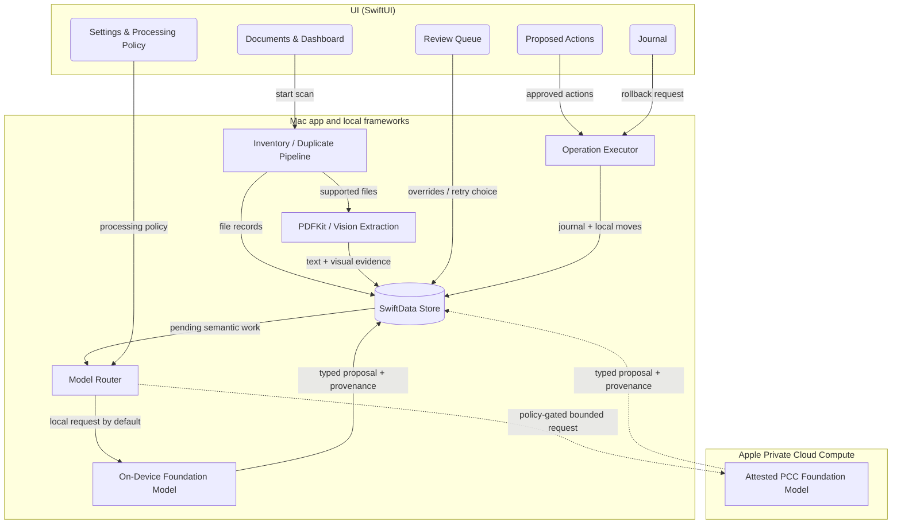

# Design Document: Private Archive Organizer

## Overview

Discovery (product name: Private Archive Organizer) is a sandboxed SwiftUI macOS app with a macOS 26.5 local-only baseline and a macOS 27 enhanced path for multimodal Foundation Models and Apple's Private Cloud Compute. It implements a staged, resumable document pipeline: **inventory → duplicate detection → local extraction/visual evidence → model routing → classification → naming → proposal → approved execution**, with a Review Queue absorbing every ambiguous case and an append-first Operation Journal making every filesystem change verifiable and reversible.

The architecture enforces the spec's central invariant structurally: the probabilistic components can only write recommendations, summaries, and non-content provenance into the local store. Only the deterministic Operation Executor touches archive files, and it accepts only validated, user-approved `ProposedAction` values. Local filesystem work never leaves the Mac. Semantic requests default to `SystemLanguageModel`; `PrivateCloudComputeLanguageModel` is available only when the user has enabled the Apple Private Cloud Allowed policy and the app has the required platform capability and entitlement. No Claude, OpenAI, Gemini, extension-model, analytics, or arbitrary provider path exists.

The model layer uses guided generation (`@Generable`) through a Model Router. macOS 26 remains useful for text-first local processing. macOS 27 adds multimodal on-device prompts and the eligible PCC server model, whose larger context and reasoning can be used autonomously within the user's persisted policy. When no Approved Apple Model is permitted and available, deterministic stages continue and semantic work parks as pending.

> **Note for implementing agents:** macOS 27, Xcode 27, multimodal Foundation Models, and developer PCC access are currently beta-era APIs. Verify exact signatures, availability annotations, entitlement names, sandbox behaviour, and quota APIs against the installed SDK and the current Apple documentation before implementation. Adapt API names when required; do not weaken the Processing Policy or substitute a third-party model.

## Goals / Non-Goals

**Goals:**
- Implement the full Requirements 1–16 pipeline in one native app with local extraction and Apple-only semantic processing.
- Default to on-device processing while supporting explicitly enabled, policy-gated PCC on eligible macOS 27 systems (Req 5, 11, 16).
- Make local privacy boundaries structural through sandboxing, selected-folder access, app-container-only metadata, and absence of arbitrary provider networking (Req 1, 11).
- Make every archive mutation approved, hash-verified, journaled, and rollback-capable (Req 7, 8, 10).
- Handle text-free and image-only files honestly: multimodal reasoning when available, otherwise human review (Req 4, 5, 13).
- Keep probabilistic output strictly advisory and record which Apple execution tier produced it (Req 5, 16).
- Ship CI-safe tests against synthetic fixtures only, with live model/PCC tests separately gated (Req 14).

**Non-Goals:**
- Multiple Archive Roots — v1 supports exactly one user-selected root (Req 1.2), so all moves are same-volume renames; multi-root support and cross-volume move handling are a follow-up spec.
- Taxonomy editing UI (Req 15 fixes the taxonomy; config format is forward-compatible).
- Handwriting recognition quality guarantees, non-Latin language tuning, or guaranteed interpretation of arbitrary photographs.
- Claude, OpenAI, Gemini, extension models, generic cloud APIs, analytics, or remote summary storage.
- Background daemon / Spotlight importer / menu-bar agent — this is a foreground document app.
- Windows/Linux/iOS targets.
- Permanent deletion, even user-triggered — quarantine only.

## Decisions

### Decision 1: macOS 26.5 baseline with a macOS 27 enhanced tier

**Outcome**: Keep the existing macOS 26.5 deployment target and Apple-silicon requirement, use Swift 6 strict concurrency and SwiftUI, and conditionally enable macOS 27 multimodal and PCC APIs behind `@available(macOS 27.0, *)` capability checks. The committed template project is updated in place and receives a shared `Discovery` scheme.

**Reasoning**: macOS 26 provides the stable text-first Foundation Models baseline and local Vision OCR, so the app can deliver the deterministic and on-device portions without depending on beta-only capabilities. macOS 27 materially improves this use case through image prompts, Vision tools callable by the model, an 8K on-device context on newer devices, and the 32K PCC model with reasoning. A dual tier prevents the beta feature set from silently becoming the minimum viable product while preserving a direct upgrade path.

**Alternative Options**: Raise the minimum to macOS 27 (simpler implementation but beta-only and excludes the stable baseline); freeze all cloud and multimodal work until macOS 27 ships (lower short-term risk but fails the approved PCC requirement).

### Decision 2: Sandbox plus an Apple-only PCC capability boundary

**Outcome**: Ship with App Sandbox, user-selected read/write folders, and app-scoped bookmarks. The Local Only build/policy contains no arbitrary network client path. PCC support is compiled only for macOS 27+, exposed only when the Apple PCC capability entitlement is present and `PrivateCloudComputeLanguageModel` is available, and invoked exclusively through Foundation Models. Do not add a third-party networking SDK or provider key. Verify with the Xcode 27 SDK whether PCC's system service requires any generic sandbox network entitlement; if it does, document and narrowly test that requirement before changing entitlements.

**Reasoning**: The original no-network entitlement was a strong local guarantee but would make the newly approved cloud mode impossible if the SDK requires an outbound capability. The replacement boundary is still mechanically narrow: selected folders and app-container persistence for local data, a single Apple framework entry point for optional cloud inference, and Processing Policy checks before every request. This reflects PCC's technical security model without pretending a networked mode has zero residual risk.

**Alternative Options**: Maintain separate Local Only and PCC app targets (stronger binary separation but doubles signing and QA); add a generic HTTP client for Apple or other providers (rejected because it broadens the attack surface and bypasses PCC's OS-integrated guarantees).

### Decision 3: Persistence with SwiftData in the app container

**Outcome**: All metadata — inventory, extraction results, recommendations, summaries, review items, journal — lives in one SwiftData store under `Application Support/Discovery/` inside the sandbox container. Nothing except archive documents and the Quarantine Folder is ever written inside the Archive Root (Req 1.6). Concurrency pattern: one shared `ModelContainer`; each pipeline actor (`InventoryScanner`, `ExtractionEngine`, `ClassificationService`, `SummarisationService`, `OperationExecutor`) is a `@ModelActor` owning its own `ModelContext`. Values crossing actor boundaries are either `PersistentIdentifier`s or dedicated `Sendable` snapshot structs — never `@Model` class instances (which are not `Sendable` and will not compile under Swift 6 strict concurrency). `ArchiveRoot` in the interfaces below is such a snapshot struct, not the `ArchiveRootRecord` model.

**Reasoning**: SwiftData is Apple-native (no dependency), integrates with SwiftUI observation, and is sufficient for tens of thousands of records. Keeping metadata out of the Archive Root keeps user folders clean and makes Req 1.6 testable as a path-prefix property. Pinning the `@ModelActor`/snapshot pattern up front prevents the classic Swift 6 stall where `@Model` instances get passed between actors and nothing compiles.

**Alternative Options**: GRDB/SQLite (more control, but adds a dependency and boilerplate for v1); JSON files (no query capability, fragile for the journal).

### Decision 4: Write-ahead journaling for crash safety

**Outcome**: Every filesystem operation writes a `JournalEntry` with state `pending` *before* touching the filesystem, then flips it to `committed` or `failed` afterwards. On launch, `pending` entries are reconciled by hash-probing source and destination paths, marked `interrupted`, and routed to the Review Queue.

**Reasoning**: Req 7.5/8.4 require the journal to be the source of truth for rollback; a post-hoc log can miss a crash mid-move. Write-ahead entries mean the journal can always explain the filesystem state, and reconciliation makes interrupted batches visible instead of silent (Req 13.1 "aborted operations").

**Alternative Options**: FSEvents-based after-the-fact auditing (observational, cannot drive rollback); APFS snapshots (require elevated privileges, violate least-privilege).

### Decision 5: Guided generation behind a deterministic Model Router

**Outcome**: Classification and summarisation use `LanguageModelSession.respond(to:generating:)` with `@Generable` output types. A `ProcessingPolicy` defaults to `.localOnly`; when the user enables `.applePrivateCloudAllowed`, a Model Router may choose `PrivateCloudComputeLanguageModel` for requests that exceed the local context budget, require supported multimodal reasoning, fail locally for a retryable capability reason, or are explicitly retried with PCC. The category remains constrained to the fixed taxonomy + `unknown`; default review threshold is 0.7. Every result stores a non-content `ModelExecutionRecord`.

**Reasoning**: Guided generation preserves the schema and advisory boundary regardless of execution tier. A persistent one-time policy gives the requested autonomy without per-document consent fatigue, while deterministic routing and visible provenance prevent silent cloud use. The on-device model remains the lowest-risk default; PCC is used only for capability-driven cases within the user's explicit Apple-only consent.

**Alternative Options**: Always use PCC when enabled (unnecessary disclosure and quota use); prompt before every PCC call (stronger per-request consent but undermines autonomous archive processing); route to external providers when quota is exhausted (rejected by Req 5.8 and 11.4).

### Decision 6: Local extraction first; multimodal understanding is separate

**Outcome**: Text-layer PDFs use PDFKit per page; sparse/image pages render at 300 DPI and run through Vision OCR. Images also run through applicable local barcode recognition and optional generic Vision classification to produce `VisualEvidence`. Office formats use local parsers. Vision OCR and classification are treated as task-specific extraction signals, not general semantic comprehension. On macOS 27+, the Model Router can pass bounded page images alongside text to the on-device multimodal model or, under the Apple Private Cloud Allowed policy, to PCC. Text-free images on macOS 26 or without a permitted multimodal model go to the Review Queue.

**Reasoning**: OCR answers “what text is visible,” while barcode and image classification answer narrow detector questions; neither reliably explains an arbitrary document layout or photograph. Separating local extraction from semantic visual reasoning prevents false confidence and directly handles image-only documents. Per-page processing also preserves hybrid PDFs without dropping scanned attachments.

**Alternative Options**: Treat any Vision label as a document classification (too coarse and unsafe); send every page image to PCC (unnecessary exposure and quota consumption); reject all text-free files (safe but wastes macOS 27's multimodal capability).

### Decision 7: Deterministic near-duplicate detection — text shingles + perceptual hash

**Outcome**: Two deterministic signals: (a) Jaccard similarity ≥ **0.70** between 4-character shingle sets of normalized Extracted Text; (b) for image-bearing documents, 64-bit dHash Hamming distance ≤ **10** on the first page/image. Either signal flags a Near-Duplicate Candidate. Pairs already grouped as Exact Duplicates are excluded before comparison.

**Reasoning**: Req 3.2 requires determinism and no model involvement; both measures are pure functions of file bytes. Thresholds are named constants so the fixture-anchored test (Req 3.4) pins behaviour. Pairwise comparison is O(n²) but bounded by comparing only within same broad type (text-bearing vs image-only) — fine at personal-archive scale.

**Alternative Options**: MinHash/LSH indexing (only needed if archives exceed ~50k documents; keep as noted optimisation); Vision feature-print distance (model-adjacent and less explainable; excluded by Req 3.2's "no model involvement").

### Decision 8: Naming convention

**Outcome**: `YYYY-MM-DD_<Category>_<IssuerSlug>.<ext>` — document date (falls back to file creation date only via Review Queue confirmation, Req 6.4), category folder name, issuer/subject slugified to `[A-Za-z0-9-]`, max 80 chars before extension; collision suffix `_2`, `_3`, … (Req 6.3). Charset scoping: `[A-Za-z0-9-]` constrains the *issuer slug component only*; the assembled filename validator accepts `[A-Za-z0-9-_.]` (the `_` separators and extension dot). Validation is a pure function `validateFilename(_:in:)`.

**Reasoning**: Sorts chronologically in Finder, is charset-safe on APFS and exFAT backups, and every field is either deterministic or human-confirmed. A pure validation function makes Req 6.2 property-testable.

**Alternative Options**: `<Category>/<Year>/` deep hierarchies (harder to flatten/rollback; category folders already partition), spaces in names (breaks scripts users may run over the archive).

### Decision 9: Evidence selection and model-call budgets

**Outcome**: Build a bounded `SemanticRequest` from high-value evidence: document head, issuer/date candidates, selected OCR passages, and at most the page images required to resolve ambiguity. Read `contextSize` from the chosen model rather than hard-coding one universal cap. Reserve prompt/output headroom and target no more than 75% of the reported context. Expected current capacities are 4,096 tokens for the macOS 26 on-device model, 8,192 on macOS 27 on newer devices, and 32,768 for PCC. Stored summaries remain deterministically capped at 500 characters.

**Reasoning**: Static 2,000/3,000 character caps underuse PCC and do not account for images or changing model capacities. Dynamic budgeting makes routing explainable: use on-device when the request fits; use PCC only when policy permits and added capacity or reasoning is required. Evidence minimisation also reduces both privacy exposure and hallucination surface.

**Alternative Options**: Send full documents (wastes context and discloses unnecessary material); chunk every document through PCC (higher disclosure and quota use); retain fixed character caps (simple but poorly matched to multiple models).

### Decision 10: Single Archive Root in v1

**Outcome**: The first release supports exactly one Archive Root (Req 1.2). Category folders and `_Quarantine` live directly under it; selecting a new root replaces the old after explicit confirmation.

**Reasoning**: Preflight review found that the earlier multi-root design silently consolidated documents from all roots under one "primary" root — surprising user-facing behaviour — and introduced cross-volume moves (`EXDEV` rename failures, non-atomic copy+delete) that the write-ahead journal design did not address. With one root, every move is a same-volume atomic rename, which keeps Properties 1–3 simple and true. Confirmed with the user on 2026-07-13.

**Alternative Options**: Per-root category folders (files never leave their volume, but categories split across roots); consolidation under a primary root with a journaled copy+verify+delete `EXDEV` fallback (more machinery for a v1 nobody asked for). Either can be a follow-up spec without changing the executor's contract.

### Decision 11: PCC is approved with documented residual risk

**Outcome**: Treat PCC as an Approved Apple Model tier, not as an ordinary third-party provider and not as equivalent to local processing. The product disclosure records Apple's published guarantees — stateless computation, encryption to attested nodes, no privileged runtime access, anti-targeting, and public release transparency — alongside residual risks: implementation vulnerabilities, compromised endpoints or client code, account/region/quota dependencies, legal compulsion at the platform boundary, and the fact that selected evidence leaves the Mac.

**Reasoning**: Apple's architecture provides materially stronger technical privacy properties than a conventional hosted consumer chat service whose safeguards principally rely on provider controls, retention settings, and access policy. Those guarantees justify optional use for this threat model, but “lowest reasonably achievable risk” still requires local-first routing, data minimisation, visible provenance, and a revocable policy.

**Alternative Options**: Describe PCC as risk-free (unsupported absolute claim); treat PCC identically to Claude/OpenAI (ignores material architectural guarantees and the user's approved threat model).

## Architecture



Control flow is a per-document state machine stored on `InventoryRecord.status`:

```
discovered → hashed → extracted | extractionFailed | unsupported | unreadable
extracted → classified | reviewPending
classified/userOverridden → named | reviewPending
named → proposed → approved → moved (terminal, rollbackable)
any model stage in Degraded Mode → pendingModel
```

Stages are pull-based: each pipeline actor queries the store for records in its input status, processes them, and advances the status. This makes the pipeline resumable after quit/crash with no in-memory queue to lose, and makes Degraded Mode trivial (model stages simply don't pull).

## Components and Interfaces

Source layout (all paths relative to repo root):

```
Discovery.xcodeproj
Discovery/
  DiscoveryApp.swift              // @main, ModelContainer setup
  Entitlements/Discovery.entitlements
  Config/Taxonomy.json            // Req 15.3 single local configuration
  Domain/
    Types.swift                   // Category, DocumentStatus, errors
    ArchiveAccess.swift           // ArchiveAccessManager
    InventoryScanner.swift
    HashService.swift
    DuplicateDetector.swift
    Extraction/
      ExtractionEngine.swift
      PDFExtractor.swift  OCRExtractor.swift  VisualEvidenceExtractor.swift  OfficeExtractor.swift
    ModelServices/
      ProcessingPolicy.swift
      ModelAvailability.swift
      ModelRouter.swift
      ClassificationService.swift
      SummarisationService.swift
    NamingEngine.swift
    Execution/
      OperationExecutor.swift
      JournalReconciler.swift
  Persistence/
    Models.swift                  // SwiftData @Model classes
    Store.swift
  UI/
    MainWindow.swift  DocumentsView.swift  ReviewQueueView.swift
    ProposedActionsView.swift  DuplicatesView.swift  JournalView.swift
    SettingsView.swift  OnboardingView.swift
DiscoveryTests/
  Fixtures/FixtureFactory.swift   // generates synthetic fixtures at test time
  ...one test file per component...
DiscoveryUITests/
  SmokeTests.swift
```

Key interfaces (signatures the implementation must keep):

```swift
// Domain/Types.swift
enum Category: String, Codable, CaseIterable { case financial, medical, employment, identity, other }
enum DocumentStatus: String, Codable { case discovered, hashed, unsupported, unreadable,
    extracted, extractionFailed, classified, reviewPending, pendingModel,
    userOverridden, named, proposed, approved, moved }

// Domain/ArchiveAccess.swift — Req 1
// ArchiveRoot is a Sendable snapshot of ArchiveRootRecord, safe to cross actor boundaries.
struct ArchiveRoot: Sendable, Identifiable {
    let id: UUID; let displayPath: String; let bookmarkData: Data
}
@MainActor final class ArchiveAccessManager: ObservableObject {
    func selectRoot() async throws -> ArchiveRoot          // NSOpenPanel + bookmark; replaces existing root after confirmation (1.1, 1.2)
    func resolveRoot() -> ArchiveRoot?                     // nil + unavailable flag when the bookmark fails (1.4)
    func removeRoot()                                      // 1.5
    // Primary form: async — scoped access must span the awaited I/O inside `body`,
    // so start/stopAccessingSecurityScopedResource bracket the full async call.
    func withAccess<T: Sendable>(to root: ArchiveRoot, _ body: (URL) async throws -> T) async rethrows -> T
    func withAccess<T>(to root: ArchiveRoot, _ body: (URL) throws -> T) rethrows -> T   // sync convenience only
}

// Domain/InventoryScanner.swift — Req 2
@ModelActor actor InventoryScanner {
    func scan(root: ArchiveRoot) async throws -> ScanReport   // upsert-by-path, hash-diff resets (2.5, 2.6)
}

// Domain/HashService.swift
enum HashService { static func sha256(of url: URL) throws -> String }   // streaming, CryptoKit

// Domain/DuplicateDetector.swift — Req 3
struct DuplicateDetector {
    static let jaccardThreshold = 0.70
    static let dHashMaxDistance = 10
    func exactGroups(in records: [InventoryRecord]) -> [[InventoryRecord]]
    func nearDuplicateCandidates(in records: [InventoryRecord],
                                 texts: (InventoryRecord) -> String?) -> [NearDuplicatePair]
}

// Domain/Extraction/ExtractionEngine.swift — Req 4
actor ExtractionEngine {
    static let insufficientThreshold = 25
    func extract(_ record: InventoryRecord, in root: ArchiveRoot) async -> ExtractionOutcome
}
struct VisualEvidence: Sendable {
    let recognizedText: String?
    let barcodeKinds: [String]          // payload omitted unless explicitly required
    let imageLabels: [LabeledConfidence]
    let imageInputs: [PreparedImage]    // bounded, ephemeral model inputs
}
enum ExtractionOutcome {
    case text(String, visual: VisualEvidence, method: ExtractionMethod)
    case visualOnly(VisualEvidence)
    case failed(reason: String)
}

// Domain/ModelServices — Req 5, 9, 11, 12, 16
enum ProcessingPolicy: String, Codable { case localOnly, applePrivateCloudAllowed }
enum ModelExecutionTier: String, Codable { case onDevice, privateCloudCompute }
struct ModelExecutionRecord: Codable, Sendable {
    let tier: ModelExecutionTier
    let osVersion: String
    let promptVersion: String
    let timestamp: Date
    let modality: String
}
struct SemanticRequest: Sendable {
    let textEvidence: String
    let imageEvidence: [PreparedImage]
    let purpose: ModelPurpose
}
@Generable enum GenerableCategory: String { case financial, medical, employment, identity, other, unknown }
@Generable struct CategoryRecommendation {
    @Guide(description: "Best-fitting document category") var category: GenerableCategory
    @Guide(description: "Confidence between 0 and 1", .range(0...1)) var confidence: Double
    @Guide(description: "Issuing organisation or subject, short") var issuer: String
    @Guide(description: "Primary document date, ISO 8601, empty if absent") var documentDate: String
}
@available(macOS 27.0, *)
actor ModelRouter {
    func respond<T: Generable>(
        to request: SemanticRequest,
        policy: ProcessingPolicy,
        generating: T.Type
    ) async throws -> (T, ModelExecutionRecord)
}
actor ClassificationService {
    var reviewThreshold: Double
    func classify(_ request: SemanticRequest) async throws -> (CategoryRecommendation, ModelExecutionRecord)
}
actor SummarisationService {
    static let outputCap = 500
    func summarise(_ request: SemanticRequest) async throws -> (String, ModelExecutionRecord)
}
enum ModelAvailability {
    static func onDeviceStatus() -> SystemLanguageModel.Availability
    @available(macOS 27.0, *) static func pccStatus() -> PCCAvailabilitySnapshot
}

// Domain/NamingEngine.swift — Req 6
struct NamingEngine {
    func propose(date: Date?, category: Category, issuer: String?, originalExtension: String,
                 existingNames: Set<String>) -> NamingResult   // .name(String) | .gap([MissingField])
    static func validate(_ name: String) -> Bool                // charset, ≤80 + ext, no path separators
}

// ProposedAction drafting has two independent sources (both land as ProposedAction rows):
//  - rename/move: threshold-passing or overridden category → NamingEngine → destination under the category folder (6.1, 5.5, 13.2)
//  - quarantine: Exact Duplicate nominations from the Duplicate Detector → direct construction targeting
//    `_Quarantine/<original-filename>`, no NamingEngine involved (3.6, 10.1, 10.2)

// Domain/Execution/OperationExecutor.swift — Req 7, 8, 10
actor OperationExecutor {
    func execute(_ actions: [ProposedAction]) async -> BatchResult     // WAL journal, hash-verify, never overwrite
    func rollback(_ entries: [JournalEntry]) async -> RollbackReport   // hash-verify, skip-and-report (8.3)
}
```

**Taxonomy.json** (Req 15) — bundled resource, decoded once at launch:

```json
{ "version": 1,
  "categories": [
    { "id": "financial",  "displayName": "Financial",  "folderName": "Financial"  },
    { "id": "medical",    "displayName": "Medical",    "folderName": "Medical"    },
    { "id": "employment", "displayName": "Employment", "folderName": "Employment" },
    { "id": "identity",   "displayName": "Identity",   "folderName": "Identity"   },
    { "id": "other",      "displayName": "Other",      "folderName": "Other"      } ] }
```

Destination folders are created on demand as `<Archive Root>/<folderName>/`; the Quarantine Folder is `<Archive Root>/_Quarantine/` (Req 10.2). The single Archive Root is chosen during onboarding (Decision 10).

## Data Models

SwiftData `@Model` classes in `Persistence/Models.swift` (fields are the contract; adjust attributes as SwiftData requires):

```swift
@Model final class ArchiveRootRecord {          // exactly one row in v1 (Req 1.2, Decision 10)
    var id: UUID; var displayPath: String; var bookmarkData: Data
    var isAvailable: Bool
}

@Model final class InventoryRecord {                       // Req 2
    var id: UUID; var rootID: UUID; var relativePath: String
    var fileSize: Int64; var createdAt: Date; var modifiedAt: Date
    var contentType: String                                 // UTType identifier
    var supportKind: String                                 // textPDF|scannedPDF|image|office|unsupported
    var contentHash: String                                 // SHA-256 hex
    var status: String                                      // DocumentStatus.rawValue
    var extractedText: String?                              // app container only (1.6, 11)
    var extractionMethod: String?
    var visualEvidenceMetadata: Data?                       // no image/barcode payloads
    var recommendedCategory: String?; var confidence: Double?
    var overriddenCategory: String?                         // authoritative when set (13.2)
    var recommendedIssuer: String?; var recommendedDate: Date?
    var classificationExecution: Data?                      // ModelExecutionRecord
    var summary: String?; var summaryPending: Bool          // Req 9
    var summaryExecution: Data?                             // ModelExecutionRecord
    var classificationPending: Bool                         // Degraded Mode (12.4)
}

@Model final class NearDuplicatePair {                      // Req 3, 13.3
    var hashA: String; var hashB: String                    // identity = unordered hash pair
    var signal: String                                      // "jaccard:0.83" | "dhash:6"
    var dismissed: Bool                                     // user rejection suppresses re-flagging
}

@Model final class ProposedAction {                         // Req 6, 7, 10
    var id: UUID; var recordID: UUID
    var kind: String                                        // move|rename|quarantine
    var sourcePath: String; var destinationPath: String
    var expectedHash: String
    var state: String                                       // draft|awaitingApproval|approved|executed|aborted
}

@Model final class JournalEntry {                           // Req 7.5, 8
    var id: UUID; var timestamp: Date
    var operationType: String                               // move|rename|quarantine|rollback
    var beforePath: String; var afterPath: String
    var contentHash: String
    var state: String                                       // pending|committed|failed|interrupted|rolledBack
    var failureReason: String?
    var batchID: UUID                                       // batch rollback unit (8.1)
}

@Model final class ReviewItem {                             // Req 13
    var id: UUID; var recordID: UUID?
    var reason: String   // lowConfidence|unknownCategory|extractionFailed|nearDuplicate|namingGap|abortedOperation|pendingModel
    var payload: Data?                                      // reason-specific evidence (codable)
    var resolved: Bool; var resolution: String?
}
```

Diagnostics export (Req 11.5) is a dedicated `DiagnosticsExporter` that serialises **only**: status counts, error codes, timestamps, and Content Hashes. It never reads `extractedText`, `summary`, path, or filename fields — enforced by constructing the export from a projection struct that simply has no such fields.

## Correctness Properties

### Property 1: Move hash round-trip
For any executed move or quarantine, the destination file's SHA-256 equals the journaled `contentHash`, which equals the pre-move Inventory Record hash.
**Validates: Requirements 7.2, 7.5, 10.4**

### Property 2: No overwrite, ever
For any batch containing an action whose destination exists at execution time, after execution the pre-existing destination file's bytes are unchanged and the action's state is `aborted` with a ReviewItem created.
**Validates: Requirements 7.4, 13.1**

### Property 3: Rollback restores the journaled world
For any committed batch whose files are untouched afterwards, `rollback(batch)` results in every file existing at its `beforePath` with its journaled hash, and journal states `rolledBack`. Tampered targets (hash mismatch) are skipped and reported while the rest are restored.
**Validates: Requirements 8.1, 8.2, 8.3**

### Property 4: Duplicate detection is a pure function
For any set of Inventory Records, running the Duplicate Detector twice yields identical Exact Duplicate groups and identical Near-Duplicate Candidate sets; no pair grouped as Exact Duplicates appears among candidates.
**Validates: Requirements 3.1, 3.2, 3.3**

### Property 5: Naming is deterministic, valid, and collision-free
For any (date, category, issuer, extension, existingNames): the proposed name is identical across calls, passes `validate`, does not collide with `existingNames` (suffix applied), and missing required fields always yield `.gap`, never an invented value.
**Validates: Requirements 6.1, 6.2, 6.3, 6.4**

### Property 6: Insufficient Extraction routing
For any extraction result with fewer than 25 non-whitespace characters, the record's status becomes `extractionFailed` and a ReviewItem with reason `extractionFailed` exists; with ≥ 25, the record proceeds to classification input.
**Validates: Requirements 4.5, 13.1**

### Property 7: Threshold routing of recommendations
For any recommendation with confidence < reviewThreshold or category `unknown`, the record enters `reviewPending` and no ProposedAction is drafted from it; at or above the threshold with a known category, naming proceeds.
**Validates: Requirements 5.4, 6.1**

### Property 8: Writes are territorially confined
For any pipeline run over fixtures, every file created/modified/moved on disk is under the Archive Root (documents, category folders, `_Quarantine`) or under the app container (store); no writes elsewhere.
**Validates: Requirements 1.6, 7.6**

### Property 9: Scan is read-only and upsert-stable
For any folder tree, scanning changes no file bytes/dates under the roots; re-scanning an unchanged tree yields the same record set (by path+hash); re-scanning after a content change updates that record's hash and resets its downstream statuses to pending.
**Validates: Requirements 2.4, 2.5, 2.6**

### Property 10: Processing Policy gates every cloud request
For any semantic request under `Local Only`, no `PrivateCloudComputeLanguageModel` session is constructed or invoked. Under `Apple Private Cloud Allowed`, every cloud request uses the Apple PCC model through Foundation Models and has a matching Model Execution Record; no arbitrary provider client exists.
**Validates: Requirements 5.2, 5.3, 5.4, 11.2, 11.3, 11.4, 16.1, 16.4**

### Property 11: Summary cap and locality
For any stored summary: length ≤ 500 characters, stored only in the app-container store, and generated only when a category was assigned by threshold-passing recommendation or user override.
**Validates: Requirements 9.1, 9.2**

### Property 12: Near-duplicate dismissal is sticky by content
For any dismissed NearDuplicatePair, re-running detection over unchanged files does not recreate an active pair; changing either file's bytes (new hash) makes the pair eligible again.
**Validates: Requirement 13.3**

### Property 13: Text-free documents never receive fabricated evidence
For any image with no usable OCR text and no permitted multimodal model, the document enters Review Queue with `visualOnly` evidence and no generated category or filename proposal.
**Validates: Requirements 4.6, 4.7, 4.8, 5.1, 13.1**

### Property 14: PCC provenance is complete and content-free
For every completed or failed PCC operation, exactly one Model Execution Record identifies the PCC tier, prompt version, modality, OS version, and timestamp while containing no prompt, text, image, path, filename, summary, or barcode payload.
**Validates: Requirements 5.5, 9.4, 11.8, 16.4**

## Error Handling

| Condition | Handling |
|---|---|
| Bookmark fails to resolve (1.4) | Root marked unavailable, banner in UI prompting re-selection; records under it flagged unavailable; no privilege escalation. |
| Rename fails with a cross-device error (mount point nested inside the Archive Root) | Abort that action, journal `failed`, ReviewItem `abortedOperation`; no copy+delete fallback in v1 (Decision 10). |
| File unreadable during scan (2.7) | Record status `unreadable`, scan continues; surfaced in Documents view filter. |
| Extraction throws / insufficient (4.5) | Status `extractionFailed`, ReviewItem created; original file untouched. |
| No Approved Apple Model available (12.1) | Check on-device and, only when policy permits, PCC availability before every call and on app foreground. Show the specific hardware/OS/model/network/entitlement/quota reason; park records as pending and resume only after confirmation. |
| PCC unavailable or quota exhausted (12.5, 16.5) | Route to on-device when the request fits; otherwise park in Review Queue. Show persistent quota guidance supplied by the framework; never route to a third party. |
| Model call throws (guardrail refusal, context overflow, transient) | Retry once with reduced evidence on the same tier. If policy permits and the failure is a documented routing reason, PCC may be tried after local failure; otherwise create a content-free error record and route to review. |
| Text-free image without permitted multimodal model (4.8) | Preserve local Visual Evidence, create a ReviewItem, and do not invent a category, issuer, date, or filename. |
| Pre/post-move hash mismatch (7.3) | Abort operation; if the file already landed at destination, move it back (journaled); mark journal `failed`; ReviewItem `abortedOperation`. |
| Destination exists (7.4) | Abort that action only; batch continues; ReviewItem created. |
| Crash mid-batch | Launch-time `JournalReconciler` probes `pending` entries by hash at both paths, marks `interrupted`, creates ReviewItems; no automatic repair. |
| Rollback target missing/tampered (8.3) | Skip, record discrepancy in RollbackReport, continue remaining files. |
| SwiftData store corruption | Fail closed: app shows recovery screen offering journal export (11.5-safe fields only); never auto-deletes the store. |

## Testing Strategy

Test targets match CI: **DiscoveryTests** (unit/integration, Swift Testing) and **DiscoveryUITests** (XCUITest smoke). All document inputs come from `FixtureFactory` (Req 14), which generates fixtures deterministically at test time in a temp directory:

- **Text PDF**: CoreGraphics PDF context drawing synthetic statement text (fake bank name, fake account "0000-TEST").
- **Scanned PDF**: render the same text to a bitmap, embed as image-only PDF page (no text layer).
- **Hybrid PDF**: one real text-layer page plus one image-only page in a single document — asserts per-page OCR merging (Decision 6); a whole-document heuristic fails this fixture.
- **Images**: PNG/JPEG/HEIC renders of synthetic payslips; near-duplicate variants; a text-free ordinary photo; an image-only synthetic document whose category is visible from layout/symbols but has no usable OCR text; a fake barcode/MRZ fixture containing no real identifier.
- **Office**: DOCX (minimal OOXML zip via ZIPFoundation), XLSX (minimal sheet + sharedStrings), RTF/TXT/CSV literals.
- **Edge cases**: 0-byte file, 10-char text file (insufficient), unreadable file (permissions dropped), unsupported type (`.zip`), PCC unavailable, PCC quota exhausted, policy changed while work is queued.

Test layers:

1. **Unit (pure logic)**: NamingEngine, DuplicateDetector, extraction thresholds, visual-only routing, Model Router policy/routing matrices, dynamic context budgeting, confidence routing, summary truncation, provenance redaction, and taxonomy decoding.
2. **Integration (temp-dir filesystem)**: Scanner read-only/upsert behaviour; executor move/abort/no-overwrite/rollback; write confinement; concurrency races; queued semantic work surviving policy and availability changes.
3. **Static/config tests**: sandbox and folder entitlements; PCC capability absent/present build configurations; no provider SDK/API key or analytics dependency; DiagnosticsExporter schema excludes content; no binary documents checked in.
4. **Model-dependent tests**: On-device and PCC tests run only on eligible hardware and use Synthetic Fixtures. PCC tests require macOS 27, the assigned entitlement, an available quota, and the Apple Private Cloud Allowed test policy. CI uses mocked model adapters and must never send a live PCC request.

**CI contingency**: `ci.yml` keeps the macOS 26.5 local-only build as the stable gate. A separate macOS 27/Xcode 27 job is allowed to be conditional while the SDK is beta or unavailable on hosted runners. Never lower the deployment target or enable live PCC requests merely to make CI pass.
5. **UI smoke (DiscoveryUITests)**: launch, onboarding renders, add-folder panel appears, Review Queue and Journal views render with seeded store.

Property-style tests use randomized inputs over generators (seeded, reported on failure) within Swift Testing parameterised tests — no external property-testing dependency.


## External References

- [Private Cloud Compute Security Guide](https://security.apple.com/documentation/private-cloud-compute/)
- [Stateless Computation and Enforceable Guarantees](https://security.apple.com/documentation/private-cloud-compute/statelessandenforcable)
- [Verifiable Transparency](https://security.apple.com/documentation/private-cloud-compute/verifiabletransparency)
- [Accessing Private Cloud Compute](https://developer.apple.com/private-cloud-compute/)
- [Build with the new Apple Foundation Model on Private Cloud Compute](https://developer.apple.com/videos/play/wwdc2026/319/)
- [What's new in macOS 27](https://developer.apple.com/macos/whats-new/)
- [Vision framework](https://developer.apple.com/documentation/vision)
